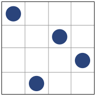
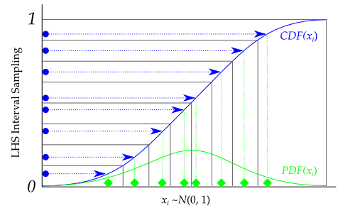

# Randomized Designs

In this section, the following kinds of *randomized designs* will 
be described:

- [Latin-Hypercube](#latin-hypercube)
- [Random K-Means](#random-k-means)
- [Random Uniform](#random-uniform)

!!! tip "Quick Start"
    All available designs can be accessed after a simple import statement:
    
    ```python
    >>> from pyDOE3 import *
    ```

## Latin-Hypercube (`lhs`) {#latin-hypercube}



Latin-hypercube designs can be created using the following simple syntax:

```python
>>> lhs(n, [samples, criterion, iterations])
```

where 

* **n**: an integer that designates the number of factors (required)
* **samples**: an integer that designates the number of sample points to 
  generate for each factor (default: n)
* **criterion**: a string that tells `lhs` how to sample the points
  (default: None, which simply randomizes the points within the intervals):
  
  - "center" or "c": center the points within the sampling intervals
  - "maximin" or "m": maximize the minimum distance between points, but
    place the point in a randomized location within its interval
  - "centermaximin" or "cm": same as "maximin", but centered within the
    intervals
  - "correlation" or "corr": minimize the maximum correlation coefficient
  - "lhsmu" : Latin hypercube with multifimensional Uniformity. Correlation between
     variable can be enforced by setting a valid correlation matrix.
  
The output design scales all the variable ranges from zero to one which
can then be transformed as the user wishes (like to a specific statistical
distribution using the `scipy.stats.distributions` `ppf` (inverse
cumulative distribution) function.

For example, if I wanted to transform the uniform distribution of 8 samples
to a normal distribution (mean=0, standard deviation=1), I would do 
something like:

```python
>>> from scipy.stats.distributions import norm
>>> lhd = lhs(2, samples=5)
>>> lhd = norm(loc=0, scale=1).ppf(lhd)  # this applies to both factors here
```

Graphically, each transformation would look like the following, going 
from the blue sampled points (from using `lhs`) to the green
sampled points that are normally distributed:



### Examples

A basic 4-factor latin-hypercube design:

```python
>>> lhs(4, criterion='center')
array([[ 0.875,  0.625,  0.875,  0.125],
       [ 0.375,  0.125,  0.375,  0.375],
       [ 0.625,  0.375,  0.125,  0.625],
       [ 0.125,  0.875,  0.625,  0.875]])
```

Let's say we want more samples, like 10:

```python
>>> lhs(4, samples=10, criterion='center')
array([[ 0.05,  0.05,  0.15,  0.15],
       [ 0.55,  0.85,  0.95,  0.75],
       [ 0.25,  0.25,  0.45,  0.25],
       [ 0.45,  0.35,  0.75,  0.45],
       [ 0.75,  0.55,  0.25,  0.55],
       [ 0.95,  0.45,  0.35,  0.05],
       [ 0.35,  0.95,  0.05,  0.65],
       [ 0.15,  0.65,  0.55,  0.35],
       [ 0.85,  0.75,  0.85,  0.85],
       [ 0.65,  0.15,  0.65,  0.95]])
```

## Random K-Means (`random_k_means`) {#random-k-means}

Random K-Means clustering design for experimental design applications.

*[Detailed content would be added here after full conversion]*

## Random Uniform (`random_uniform`) {#random-uniform}

Random uniform sampling design for generating uniformly distributed experimental points.

*[Detailed content would be added here after full conversion]*